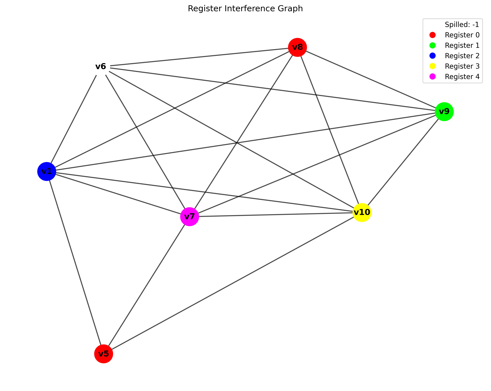
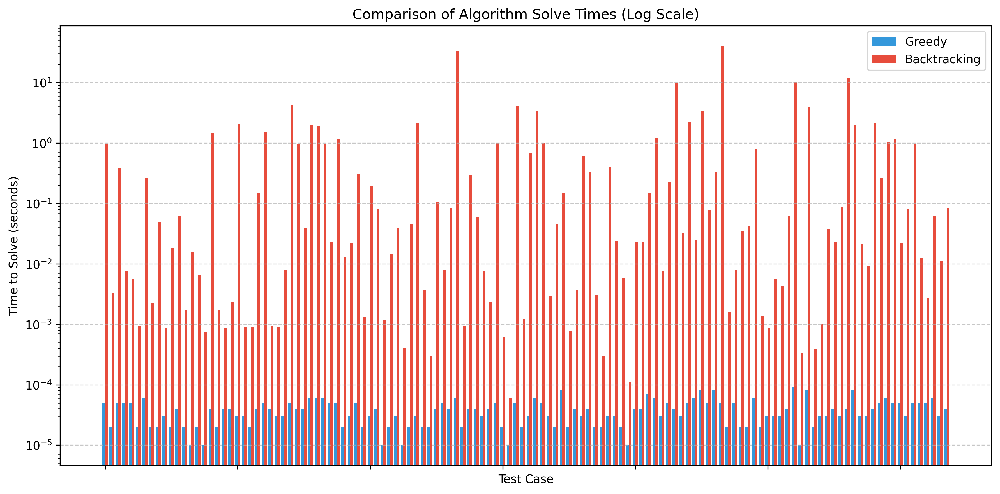
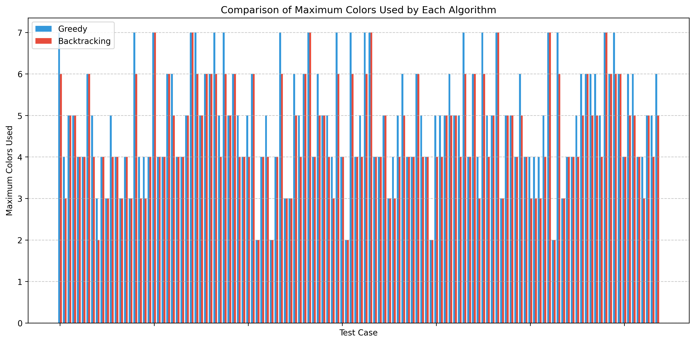
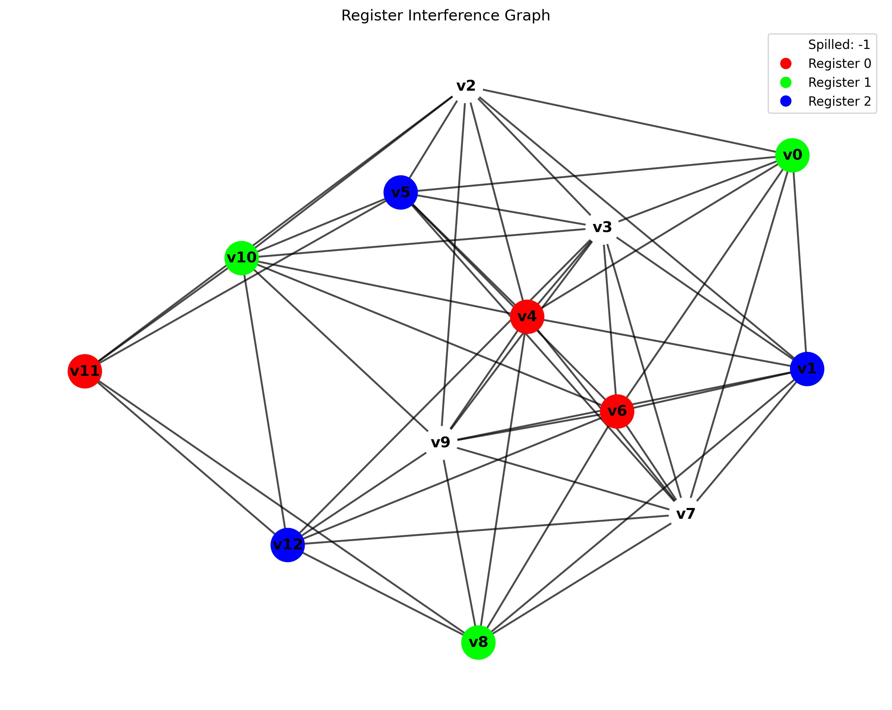
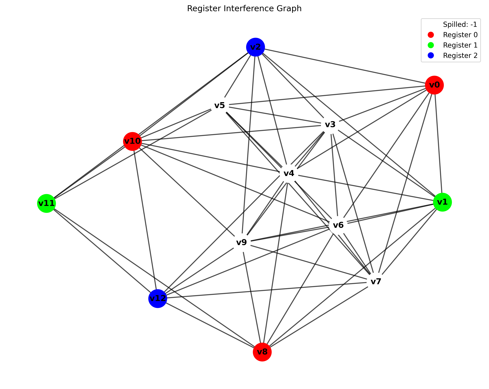

## CMPUT 366 Course Project

* Justin Meimar
* meimar@ualberta.ca
* April 7th 2025
* 1660292

#### Problem Description

Register allocation is a classical problem in code generation. The task involves mapping the live
variables within a program to a finite set of physical hardware registers. The register allocation
problem imposes that two live variables can not occupy the same register simeltaneously, since
otherwise a value will be overwritten. If at any point during the problem, there exists more live
variables than physical registers, the program must "splil" values to memory. This mechanism
ensures the correctness of the program at the cost of performance. The register allocation problem
has been approach with a variety of strategies over the years. In this project we look at two.
First a simple greedy allocator [1] and second, relevent to combinatorial search methods discuessed
in class, the backtracking allocator. On a theorhetical level, optimal register allocation
reduces to graph coloring, which is a known NP hard problem. As a result, in practice the optimal
solution is typically forgone in the interest of compilation speed. Through the experiments 
performed in this project, We seek to quantify this gap and constrast the two apporach both in terms
of runtime and solution quality. 

#### Background
The register allocation problem instance is presented most convenientely as an
*interference graph*, whereby nodes represent the variables in our program, and edges represent
variables which have overlapping *live ranges*. Variables which have overlapping ranges must be
allocated to different registers, since otherwise their values will be overwritten during execution.
In graph terms, nodes must recieve a different color for all it's neighbouring edges, hence the
problem reduces to graph coloring. One additional feature of the register allocation problem is
spilling. We reserve an additional special color for which neighbours can share, to indicate a
value must be stored in memory until a register becomes free.



To give greater context, above is the colored *interference graph* from a problem instance
which involved five hardware registers and a maximum live range of six variables. As such,
one variable, `v6`, was spilled by the backtracking allocator. Additionally, the allocator determined
that both `v8` and `v5` has disjoint live ranges, and therefore allocated both variables to the
same register.


#### Problem Setup

##### Input Representation
The first task is to find a suitable representation for the problem input and output. In Sudoku,
we used a simple string of 81 characters for a nine by nine grid, with periods representing empty
values, and digits representing constant values. Register allocation problems, however, involve
a dimension of *time*. To represent the input then we use the following format. A text file includes
`K` lines of input, the first includes a single number `N`, the number of registers in computer,
and each subsequent line is sequence of space separated strings denoting the live values at a
particualr program point. An example is provided below. 

```
6
v1                              # v1 is the only value live at point 1
v1 v5
v1 v5 v8
v1 v5 v8 v9 10                  # five values are live at point 4 
v1 v3 v5 v8 v9 v10 v11           
v1 v3 v3 v5 v8 v9 v10 v11       # more than values are live at point 6 than registers.
v3 v9 v10
v9
```

##### Fuzzer
In order to avoid the tedium of writting many manual testcases , the construction of a simple fuzzer was undergone. The script,
found in `fuzzer.py`, selects a random quantity of physical registers and program variables in order to generate a plausible
sequence of points that could represent a program. For each variable it picks an arbitrary range, then writes the
instance to a file in the described format. We generated `256` random tests for the experimentation process with register capacity
ranging from `4` to `7`, program variables between `3` and `8` and the length of each variable range between `6` and `12` points (lines).

##### Input Program Generation
We approached the problem of generating interesting, well defined inputs to out reigster allocation problem with a simple python script.
We pass in the register capacity and generate, in a pseudo-random fashion, a sequence of points that could plausibly represent a program.
Typically, live variables will accumulate in the scope of a program as the programmer declares variables. Then, at a particular point,
many variables will become dead at once, as the program pops a lexical scope. For example, consider the following `RISCV` program,
translated from some high level source code.

#### Algorithms

##### Greedy Algorithm
We used a simple greedy algorithm, linear scan [1], to construct a baseline from which to compare our backtracking implementation.
Linear Scan, as expected, can allocate registers in linear time with one single pass over the interference graph. As such, it runs
in `O(v)`. Where linear scan accels in speed, it lacks in optimality. As we show in the evaluation, there are certain problem instances
for which linear scan colors a register and can not go back to change it's decision. As is also shown in the evaluation, this outcome
happens suprisingly little comapred to the optimal. The implementation can be found in `/src/allocator.py` and the pseudo-code is
presented here for simplicity.

```
Algorith: Linear_Scan(graph: G):
    colors = {}
    for v in graph.vars:
        colors[v] = -1 # spill by default
    
    for v in graph.vars: 
        # Check color of all neighbour nodes
        neighbour_colors = {}
        for n in graph.get_neighbours(v):
            if n.color not in neighbour_colors:
                neighbour_colors.add(n.color)
        
        # Check if the unique color is permissible 
        new_color = min(color not in nieghbour_colors)
        if new_color < max_registers:
            colors[v] = new_color

    return colors

```

###### Greedy Method Statistics

| Metric | Value |
|--------|-------|
| Average Runtime (s)| 3.77e-05 |
| Standard Deviation Runtime (s)| 1.72e-05 |
| Average Spilled Variables | 1.33 |
| Average Colors Used | 5.42 |

##### Backtracking Allocator

###### Overview
Here we describe the core algorithm for this project, the backtrackign allocator. The algorithm
is similar to the backtracking approach studied in Sudoku and in the course notes for graph
coloring. We can characterize each node with a *domain*, and attempt to solve the instance
recursively assigning one of the possible domain values to the current node. If a subtree 
is unable to yield a complete coloring, the algorithm will backtrack and try a different
value from a nodes domain. If no perfect colouring is found, then every combination of colors
will be completely exhausted in the search.

###### Heuristic Optimaization
The backtracking allocator uses a heuristic which may be used for selecting which node
to start the coloring process. We can sort the variables in descending order by their
edge count, such that those with the highest contention are allocated first, and those
which are relatively free from contraint are allocated last. Intuitively this makes sense, as the less contended a variable is, the more likely we will have a free register to assign it.

###### Pseduo Code and Time Complexity
The pseudo code for the algorithm (again implemented in `src/allocator.py` is given here. As
a backtracking algorithm, in the worst case in which a k-coloring can not exist without
spilling to memory, it may try every combination of domain variables possible. Consequently, the
asymptotic bound for this algorithm is `O(V^k)`, where `V` denotes the number of variables
and `k` the number of hardware registers.

```
function BacktrackingAllocator():
    BuildInterferenceGraph()
    k = GetRegisterCapacity()
    sorted_vars = SortVariablesByDegree(variables)
    colors = {var: -1 for all var in variables}
    best_colors = copy(colors)
    max_colored = 0
    
    function IsValidColor(var, color, current_colors):
        for neighbor in GetNeighbors(var):
            if current_colors[neighbor] == color: return false
        return true
    
    function Backtrack(index, current_colors, colored_count):
        if index == length(sorted_vars):
            if colored_count > max_colored:
                max_colored = colored_count
                best_colors = copy(current_colors)
            return
        
        var = sorted_vars[index]
        Backtrack(index + 1, current_colors, colored_count)
        
        for color in range(0, k-1):
            if IsValidColor(var, color, current_colors):
                current_colors[var] = color
                Backtrack(index + 1, current_colors, colored_count + 1)
                current_colors[var] = -1
    
    Backtrack(0, copy(colors), 0)
    return best_colors
```

###### Backtracking Method Statistics

| Metric | Value |
|--------|-------|
| Average Runtime | 1.25 |
| Standard Deviation Runtime | 4.89 |
| Average Spilled Variables | 1.12 |
| Average Max Colors Used | 4.97 |

#### Evaluation
We compared the algorithms along two dimensions. First, running time and second, maximum
colors used. The later metric represents the quality of the solution, where allocating
the variables into fewer registers is considered optimal. We used the `128` fuzzer generated 
inputs mentioned earlier to benchmark the algorithms. Running the project with the `--benchmark`flag produces a CSV containing metrics of interest, such as running time, max colors used and number of registers spilled.

##### Running Time


 

##### Maximum Colors



##### Investigating Problem Instances

When comparing as we do above, it is a natural question to ask for which problem instances
did the algorithms diverge for, and why? Below are two coloring of the same instance in which
backtracking was able to discover the optimal coloring, while greedy was not.



Figure 5. Backtracking on problem instance 13, spilling 4 registers.



Figure 6. Greedy on problem instance 13, spilling 6 registers.

#### Analysis
Overall, by constrasting the results from our evaluation, it is clear why the linear scan algorithm is favoured in practice. The speedup of linear scan is significant, and the test cases only considered hardware register capacity up to seven. On real machines, we typically have 32 or more registers, therefore, we can expect the runtime gap to grow dramatically. Nonetheless, it was still interesting to observe that backtracking
can indeed find the optimal coloring when greedy can not. Future work could involve improving heurisitcs
for the linear scan allocator in order to close the gap in optimality, while retaining it's speed and simplicity.

#### References


